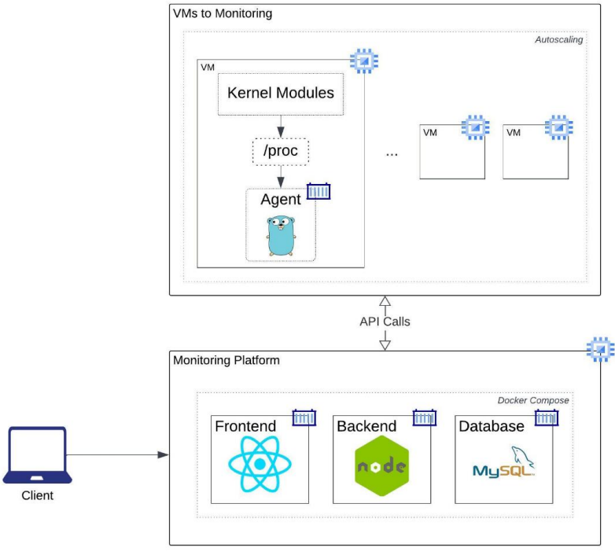

Universidad de San Carlos de Guatemala  
Facultad de Ingeniería  
Escuela de Ciencias y Sistemas  
Sistemas Operativos 1 - Sección N  
Ing. Jesus Guzman Polanco  
Aux. José Daniel Velásquez Orozco  
Aux. Jhonathan Daniel Tocay  
Segundo Semestre 2023

201700837 - Aby Noemí Palencia Reyes

# Proyecto 1

Plataforma de Monitoreo en GCP

## Arquitectura



<div style="te-xt-align: center">
<a href="https://nodejs.org"></a>
<a href="https://go.dev/"></a>
<a></a>
<a></a>
<a href="https://www.mysql.com/"></a>
<a href="https://es.reactjs.org/"></a>
<a href="https://cloud.google.com/?hl=es"></a>
<a href="https://hub.docker.com/"></a>
</div>

## Kernel Modules
### [Módulo de Ram](mods/ram_201700837.c)
Este módulo es el encargado de obtener los datos de la memoria RAM del sistema haciendo uso de la librería:
```sh
#include <linux/hugetlb.h>
```
* *hugetlb.h* permite obtener la información de la memoria ram mediante el uso del struct *sysinfo*.

Con esta información se va escribiendo un archivo, *el modulo*.

Tres métodos importantes:
#### al_abrir()
Se encarga de abrir el archivo y escribir dentro de él.

#### _insert()
Se encarga de crear el módulo.

#### _remove()
Se encarga de eliminar el módulo.

### [Módulo de CPU](mods/cpu_201700837.c)
Este módulo es el encargado de obtener los datos del CPU del sistema haciendo uso de la librería:
```sh
#include <linux/sched.h>
#include <linux/mm.h>
```
* *sched.h* permite obtener la información de todos los procesos mediente el uso del struct *task_struct*.
* *mm.h* permite obtener la información de la memoria utilizada utilizando la función *get_mm_rss()*.

Con esta información se va escribiendo una archivo, *el modulo*.

Tres métodos importantes:
#### al_abrir()
Se encarga de abrir el archivo y escribir dentro de él.

#### _insert()
Se encarga de crear el módulo.

#### _remove()
Se encarga de eliminar el módulo.

### Ejecutar y eliminar módulos
Verificar instalación de GCC y Make
```sh
gcc --version
make --version
```

Instalar Make
```sh
sudo apt update
sudo apt install make
```

Instalar GCC (también instala make)
```sh
sudo apt update
sudo apt-get update
sudo apt install build-essential
sudo apt-get install manpages-dev
```

Ejecutar los módulos
```sh
make all
sudo dmesg -C
sudo insmod ram_201700837.ko
sudo insmod cpu_201700837.ko
```

Ver el contenido del archivo creado
```sh
cd /proc
cat ram_201700837
cat cpu_201700837
```

Eliminar móudulo
```sh
sudo rmmod ram_201700837.ko
sudo rmmod cpu_201700837.ko
sudo dmesg
```
Limpiar todo
```sh
make clean
```
  
  
  


## Agente de Monitoreo
Este es un programa escrito en Golang y contenerizado en Docker. Este permite la comunicación entre la VM y la Plataforma de Monitoreo. Este cuenta con los
siguientes componentes:
### Recolector
Se encarga de realizar llamadas a los módulos de Kernel por medio de rutinas para obtener la información. La rutina en:

- Leer el módulo de kernel haciendo uso del comando `cat`
- Transformar la información contenida en el archivo del módulo de kernel
- Insertar información a la DB

#### Ejecución:
Ejecutar para instalar dependencias

```sh
go mod download
```

Ejecutar el servidor

```sh
go run main.go
```

##### Endpoints

Comprobar que el servidor se inició

```sh
http://{ipVM}:2000/
```

Comprobar ejecutar lectura de modulos

```sh
http://{ipVM}:2000/make
```
En este endpoint se utilizan 6 funciones, descritas a continuación:

- **main()**:
Se crea un servidor de *fiber* para el consumo de endpoints http.

- **lCpuUsage():**
Ejecuta comando *mpstat -o JSON* para obtener el consumo de CPU. Insertando en bruto a la db el JSON devuelto.

- **leerCpu()**
Ejecuta el comando *cat /proc/cpu_201700837* para obtener el contenido del módulo *cpu_201700837* e insertarlo en bruto a la db.

- **leerRam()**
Ejecuta el comando *cat /proc/ram_201700837* para obtener el contenido del módulo *ram_201700837* y convertir su contenido a un *Struct* para luego insertarlo a la db.

- **DbConnection()**
Crea una conexión a la base de datos de GCP.

##### Dockerfile
```sh
FROM golang:alpine

RUN apk update && apk add sysstat
WORKDIR /app

COPY go.mod ./
COPY go.sum ./
RUN go mod download

COPY *.go ./

RUN go build -o /Backend

EXPOSE 2000

CMD [ "/Backend" ]
```
* Se requiere una imagen de golang
* Se instala la liberia *sysstat*
* Se expone el puerto *2000* que es donde corre el servidor de *fiber*.  
  
  

  


## Plataforma de Monitoreo (Frontend)
Esta plataforma fue realizada haciendo uso del framework **ReactJS**.

### Ejecución de la plataforma
- Si se acaba de clonar, ejecutar:
```sh
npm i
```
- Iniciar el servidor
```sh
npm start
```
La plataforma por defecto está ejecutándose en el puerto 3000.

### Despliegue de información
* Al iniciar la aplicación será visible un mensaje de "cargando...", ya que se está consultando la *db* por medio del API.
* La tasa de actualización es de 3s. Esto haciendo uso de *React hooks*, específicamente `UseEffect`.

### Dockerfile
Se debe crear una imagen de la plataforma para poder hacer uso de *docker-compose*.
```sh
FROM node:lts-alpine

WORKDIR /app

# add `/app/node_modules/.bin` to $PATH
ENV PATH /app/node_modules/.bin:$PATH

# install app dependencies
COPY package.json ./
COPY package-lock.json ./
RUN npm i

# add app
COPY . ./
# start app
CMD ["npm", "start"]
```
* Se requiere una imagen de Nodejs
* Se instalan los módulos
  
  
  
  


## API NodeJs
Este servicio expone diversos *endpoints* que posibilitan la comunicación con la base de datos. Dichos *endpoints* serán
empleadas tanto para la lectura de información desde el Frontend como para la escritura de datos desde
los agentes instalados en las máquinas sujetas a monitoreo.
### Ejecución del API
Si se acaba de clonar
```sh
npm i
```
Iniciar el servidor
```sh
npm start
```
El *API* por defecto está ejecutándose en el puerto 5000.

### End points
Ubicados en directorio [src/Routes](Frontend/API/src/Routes/Routr.router.js)
* Obtiene los datos de la ram desde la base de datos.
```sh
http://{ipVM}:5000/api/ramdata
```
* Obtiene los datos de los *procesos* desde la base de datos.
```sh
http://{ipVM}:5000/api/procsdata
```
* Obtiene los datos del uso de *Cpu* desde la base de datos.
```sh
http://{ipVM}:5000/api/cpudata
```

### Dockerfile
Se debe crear una imagen del API para poder hacer uso de *docker-compose*.
```sh
from node:alpine

# Working directory
WORKDIR /app

# Copy package json files
COPY package*.json ./

# npm install of all nodemodules
RUN npm install

COPY . .

# Expose the API port
EXPOSE 5000

CMD [ "node", "src/index.js"]
```
* Se requiere una imagen de Nodejs
* Se instalan los módulos
* Se expone el puerto 5000
  
  
  
  


## docker-compose
Se define la estructura del contenedor definiendo el *server* y el *cliente*. La imagen de cada servicio se obteniene de Dockerhub.
```sh
version: "3"
services:
  server:
    image: abypalencia/api-pro1
    command: npm start
    volumes:
      - ./server:/api/src/app
    ports:
      - "5000:5000"
  client:
    image: abypalencia/frontend-pro1
    command: npm start
    volumes:
      - ./client:/usr/src/app
      - /usr/src/app/node_modules
    ports:
      - "3000:3000"
```
  
  
  


## Google Cloud Platform
La técnología utilizada dentro de GCP para poder hacer posible este proyecto es: *GCP Compute Engine*.

### VM Instances
Dentro de este apartado de *GCP Compute Engine* se crea una VM que contendrá la imagen de Docker dedicada para el agente de monitoreo.


### Instance Groups
Dentro de este apartado de *GCP Compute Engine* se crea un grupo de instancias que servirá para el *auto scaling* el cual se activara cuando se detecte un uso mínimo del 60% del CPU.

